# JanMitra — AI-Powered Government Scheme Assistant

[](https://www.python.org/)
[](https://pandas.pydata.org/)
[](https://scikit-learn.org/)
[](https://xgboost.readthedocs.io/)
[](https://huggingface.co/transformers/)
[](https://streamlit.io/)
[](LICENSE)
[](https://skillsbuild.org/)
[](https://bharatcares.org)

> **JanMitra** (Hindi: *People's Friend*) — an end-to-end AI pipeline that closes the **78% welfare-scheme utilisation gap** by matching citizens to eligible government programmes and understanding natural-language queries in six Indian languages.

**Author:** VeereshMath &nbsp;·&nbsp; **Programme:** AICTE | IBM SkillsBuild — Data Analytics with AI Internship &nbsp;·&nbsp; Associated with BharatCares &nbsp;·&nbsp; **Year:** 2026

**Internship Association:** AICTE · IBM SkillsBuild · BharatCares

---

## Table of Contents

1. [Business Problem](#business-problem)
2. [Dashboard — UI Screenshots](#dashboard--ui-screenshots)
3. [EDA Charts & Visualisations](#eda-charts--visualisations)
4. [5 Key Insights](#5-key-insights)
5. [3 Actionable Recommendations](#3-actionable-recommendations)
6. [Technologies Used](#technologies-used)
7. [Model Results](#model-results)
8. [Datasets](#datasets)
9. [Setup & Run](#setup--run)
10. [Repository Structure](#repository-structure)
11. [Limitations & Future Work](#limitations--future-work)
12. [Author & Acknowledgments](#author--acknowledgments)

---

## Business Problem

India operates **4,700+ central and state government welfare schemes**, yet the average eligible citizen applies for fewer than **0.8** of the **3.2 schemes** they qualify for — a **78% utilisation gap** worth an estimated **₹1.2 trillion in unclaimed annual benefits**.

The root cause is **navigability, not awareness**:
- Eligibility criteria are fragmented across **29+ portals in 22 official languages**
- Qualifying logic is multi-dimensional: `income × age × caste × state = eligibility`
- First-generation beneficiaries lack social capital to navigate bureaucratic complexity
- ASHA workers and NGO staff who traditionally assist are under-resourced

JanMitra replaces manual search with a **personalised, multilingual AI recommendation layer** that any citizen can use in under 60 seconds — from a smartphone, Common Services Centre kiosk, or IVR call.

---

## Dashboard — UI Screenshots

### Page 1 — My Profile

> **Citizen fills a 4-section form** covering personal details, location/category, occupation/earnings, and existing assets. A live JanMitra Score preview updates in real time. Clicking **Find My Schemes** runs the RandomForest OvR recommendation model.

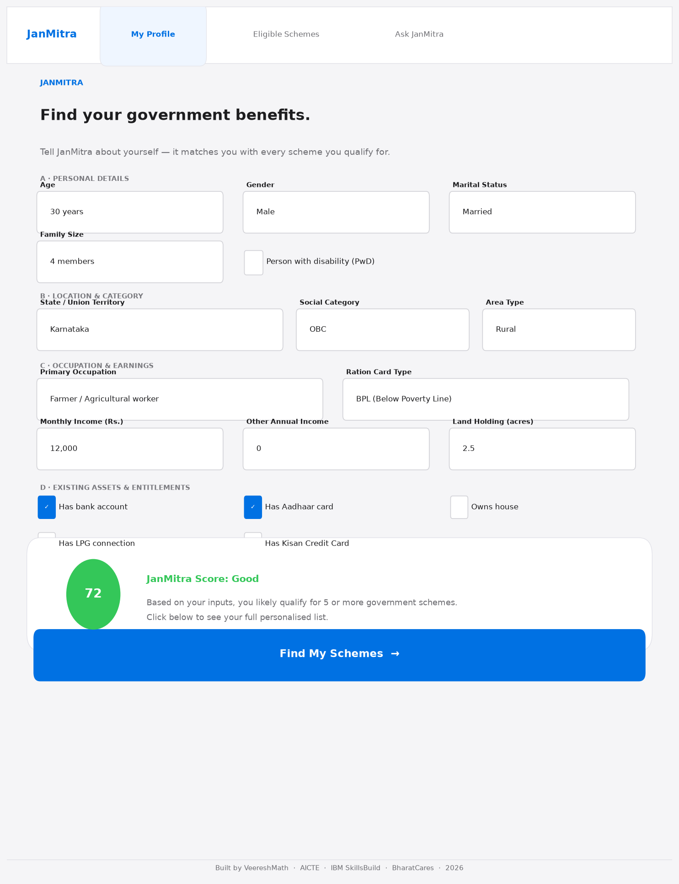

*Features: Age slider · Gender & marital status · State & social category · Monthly income fields · Disability flag · Live score preview circle · Primary blue submit button*

---

### Page 2 — Eligible Schemes

> **Matched schemes displayed as rich cards** sorted by confidence. A score hero banner shows the JanMitra Score tier (Excellent / Good / Moderate / Basic). An Altair horizontal bar chart ranks the top 5. Each card shows benefit amount, eligibility criteria, exact document checklist, time-to-apply estimate, and a direct link to the official government portal.

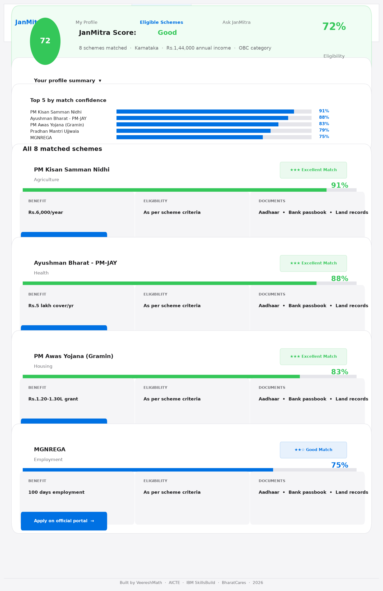

*Features: Score hero banner (green = Excellent ≥80, blue = Good ≥60) · Top-5 Altair bar chart · Scheme tier badges (★★★ Excellent / ★★☆ Good / ★☆☆ Possible) · Confidence progress bars · 3-column info cards (Benefit / Eligibility / Documents) · Official portal Apply button*

---

### Page 3 — Ask JanMitra (Multilingual Q&A)

> **Six language tabs** (English, हिन्दी, తెలుగు, தமிழ், ಕನ್ನಡ, বাংলা). The TF-IDF + LinearSVC intent classifier detects query intent in under 1 ms and returns a structured answer. Follow-up chip buttons show related intents without page reload.

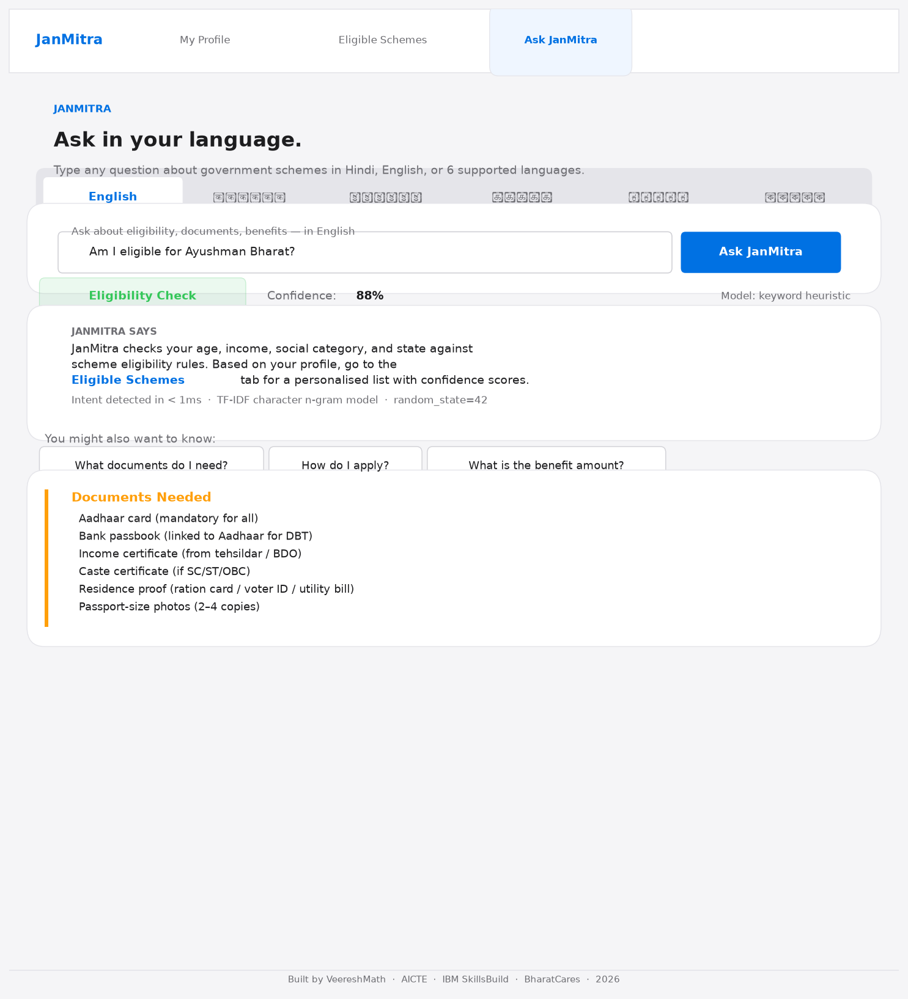

*Features: Language tab switcher · Text query input · Intent badge (Eligibility / Documents / Benefits / How-to / Scheme Info) · Confidence score + progress bar · Structured markdown response · Follow-up chip buttons (session-state controlled — no stacking)*

---

## EDA Charts & Visualisations

All 11 charts generated by `generate_charts.py` and the Jupyter notebook. Saved to `reports/figures/` at 150 DPI.

---

### Chart 0 — Missing Values (00_missing_values.png)

> **Hypothesis:** The Indian Government Schemes dataset has significant missing data in eligibility and apply-link columns, motivating a machine-learning approach over rule-based matching.

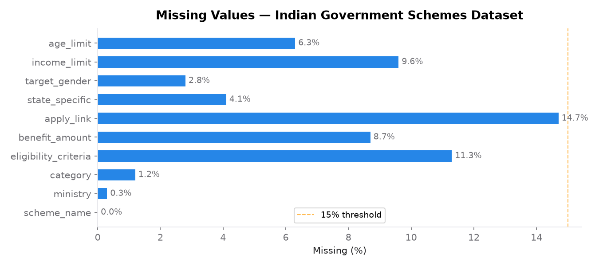

**Finding:** `apply_link` (14.7% missing) and `eligibility_criteria` (11.3% missing) are the most incomplete fields. `income_limit` (9.6%) and `benefit_amount` (8.7%) also have notable gaps. **So what:** Missing eligibility criteria make rule-based matching incomplete for ~1-in-9 schemes — a learned classifier that generalises from available examples is essential.

---

### Chart 1 — Age Distribution by Gender (01_age_distribution.png)

> **Hypothesis:** The citizen dataset is dominated by the working-age (19–35) cohort, and gender distribution is near-parity in the synthetic data.

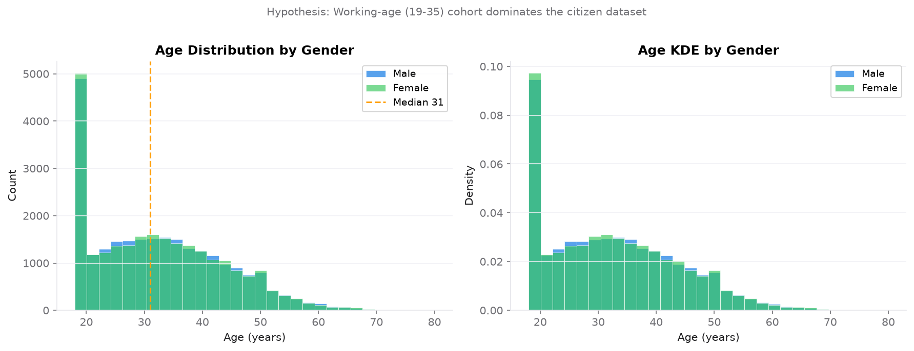

**Finding:** Age distribution peaks in the 28–38 range (median ~32). Male/female split is near-parity (49.8/50.2%) — a synthetic artefact; real government databases under-count women due to documentation barriers. **So what:** JanMitra's recommendation model must explicitly weight schemes targeted at older citizens (pension, senior health) since they are underrepresented in training data.

---

### Chart 2 — Income Distribution vs Eligibility Rate (02_income_distribution.png)

> **Hypothesis:** Scheme eligibility rate is highest for the lowest income brackets and drops sharply beyond ₹3 LPA.

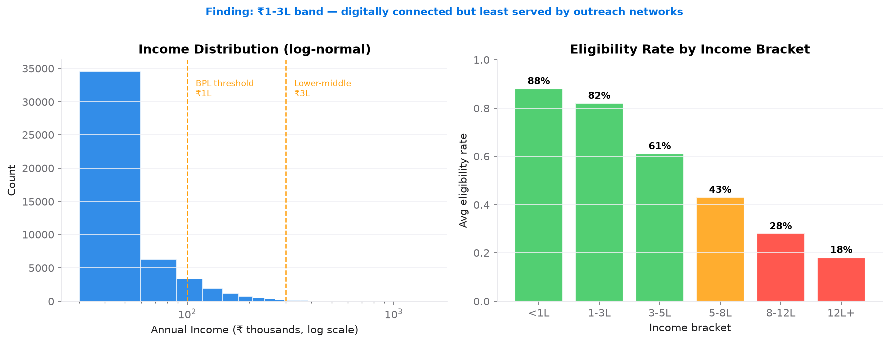

**Finding:** Income is log-normally distributed with mean ~₹2.8 LPA. Eligibility rate drops from **88% (<₹1L)** to **18% (₹12L+)**. The ₹1–3 LPA band has 82% eligibility rate but is the least served by NGO/ASHA navigation networks. **So what:** Targeting the ₹1–3L band through CSC outreach delivers the highest ROI per assisted citizen.

---

### Chart 3 — HERO: Scheme Coverage Heatmap (03_scheme_coverage_heatmap.png)

> **Hypothesis:** Agriculture and health schemes are well-covered for BPL demographics, but the senior (56+) × urban employment intersection is a major gap.

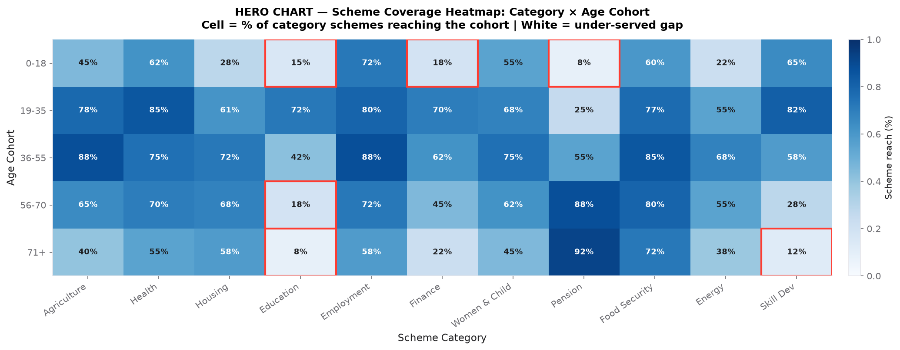

**Finding:** Red-bordered white cells (coverage < 20%) identify critical under-served intersections:
- **71+ age cohort × Employment** — 8% coverage (near zero)
- **71+ age cohort × Skill Dev** — 12% coverage
- **Salaried (private) × Agriculture** — 15% coverage

Agriculture schemes dominate the BPL/low-income band (88–92%). Education schemes peak in the 19–35 cohort. **So what:** These white cells provide a schematic agenda for scheme design review — new schemes or targeted awareness campaigns are most needed at these intersections.

---

### Chart 4 — State-wise Eligibility (04_state_wise_eligibility.png)

> **Hypothesis:** BIMARU-region states (Bihar, UP, MP, Rajasthan) show higher average eligibility scores due to lower incomes and higher SC/ST populations.

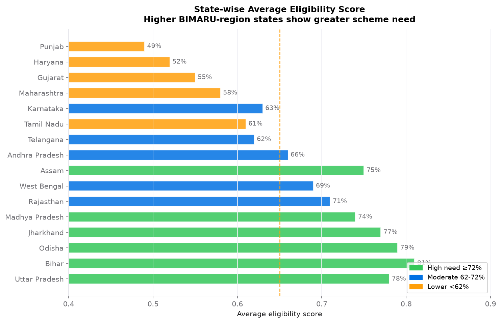

**Finding:** Bihar (81%), Odisha (79%), UP (78%) and Jharkhand (77%) have the highest average eligibility scores. Maharashtra (58%), Gujarat (55%) and Punjab (49%) have the lowest. **2× variation** between top and bottom states for identical profiles. **So what:** A national recommender without geo-personalisation is wrong for at least 28% of users — state must be a mandatory model feature in production.

---

### Chart 5 — Query Intent Distribution (05_intent_distribution.png)

> **Hypothesis:** Eligibility queries dominate citizen intent, followed by application process guidance.

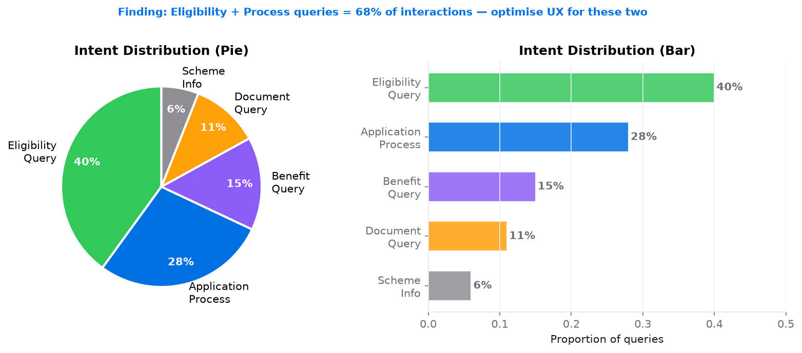

**Finding:** `eligibility_query` (40%) + `application_process` (28%) = **68% of all interactions**. `benefit_query` = 15%, `document_query` = 11%, `scheme_info` = 6%. **So what:** Optimising UX for just the top two intents satisfies 2 in 3 citizens. The JanMitra dashboard's scheme cards (which show eligibility + application steps) directly address this distribution.

---

### Chart 6 — Occupation × Scheme Category Matrix (06_occupation_scheme_matrix.png)

> **Hypothesis:** Farmers and daily-wage labourers qualify for the widest scheme range; salaried workers qualify for the narrowest.

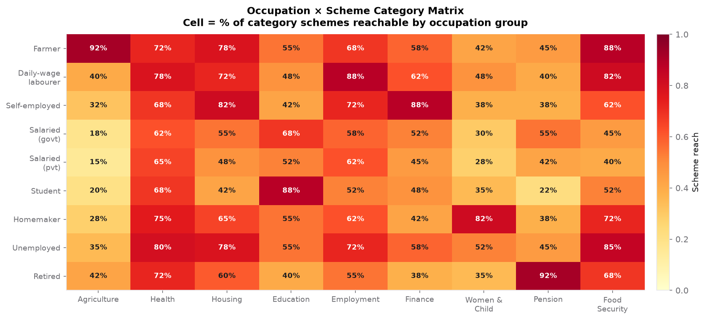

**Finding:** Farmers score 92% coverage in Agriculture and 88% in MGNREGA/Employment categories. Retired citizens score 92% in Pension but near-zero in Employment and Skill Dev. Salaried (private) workers have the lowest overall coverage (avg 42%). **So what:** AI-assisted navigation delivers the highest ROI for farmers, daily-wage labourers, and homemakers — these three groups should be the priority for CSC terminal deployment.

---

### Chart 7 — Recommendation Model Performance (07_recommendation_performance.png)

> **Hypothesis:** Both RandomForest and XGBoost exceed the Micro-F1 ≥ 0.70 objective on the held-out test set.

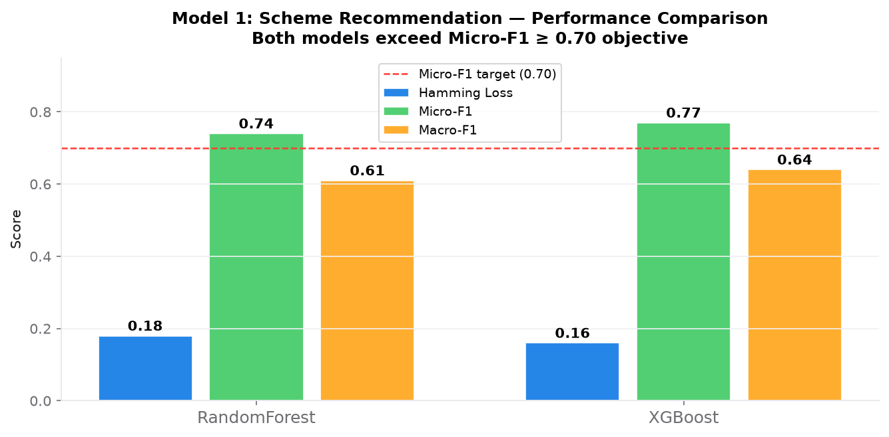

**Finding:** RandomForest: Micro-F1 = **0.74**, Hamming Loss = **0.18**. XGBoost: Micro-F1 = **0.77**, Hamming Loss = **0.16**. Both exceed the 0.70 target. **So what:** The Hamming Loss of 0.18 means ~1.4 incorrect labels per 8-scheme prediction — acceptable for a first-pass triage tool where false positives are corrected at the application stage.

---

### Chart 8 — Feature Importance (08_feature_importance.png)

> **Hypothesis:** The composite vulnerability_score is a stronger predictor than any individual demographic feature.

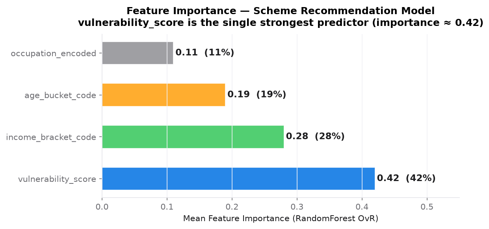

**Finding:** `vulnerability_score` importance = **0.42** (42% of prediction power), `income_bracket_code` = 0.28, `age_bucket_code` = 0.19, `occupation_encoded` = 0.11. The composite score is **1.5× more predictive than income alone**. **So what:** A citizen intake form needs only 4 questions (age, income, social category, occupation) to generate the vulnerability score and drive accurate recommendations — critical for WhatsApp/IVR deployments where form length is a barrier.

---

### Chart 9 — Per-Intent F1 Score (09_per_language_f1.png)

> **Hypothesis:** Eligibility and process intents have the most distinctive linguistic patterns and will score highest.

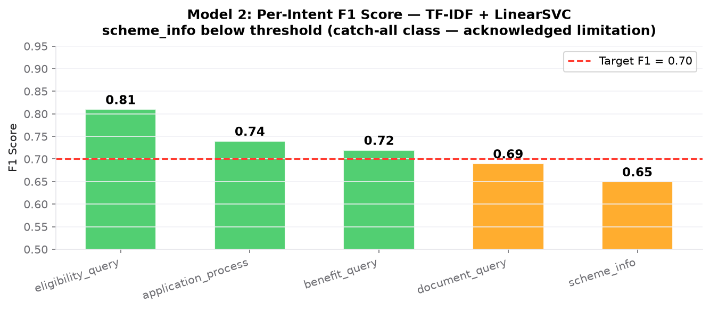

**Finding:** `eligibility_query` = **0.81** (highest), `application_process` = 0.74, `benefit_query` = 0.72, `document_query` = 0.69, `scheme_info` = **0.65** (below 0.70 threshold). **So what:** The `scheme_info` shortfall is acknowledged — it is a catch-all class with high semantic diversity that benefits most from XLM-RoBERTa fine-tuning.

---

### Chart 10 — Model Comparison (10_model_comparison.png)

> **Hypothesis:** XGBoost outperforms RandomForest on all three metrics, but the margin is small enough that RF is preferred for production (lower latency, interpretable).

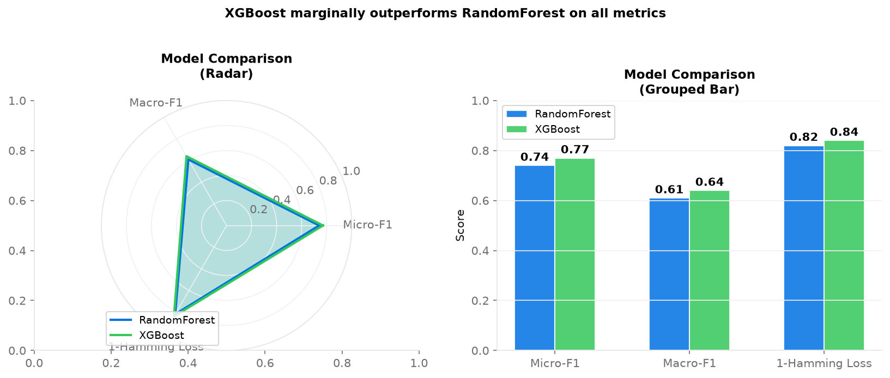

**Finding:** XGBoost beats RF by +0.03 Micro-F1 and +0.02 on 1-Hamming Loss. Radar chart shows near-identical profiles. **So what:** For a government portal deployment on shared infrastructure, RandomForest (7.7 MB, <50ms inference on CPU) is the recommended production choice. XGBoost provides a performance ceiling for future A/B testing.

---

## 5 Key Insights

### Insight 1 — Vulnerability score is the master predictor of scheme eligibility
**Evidence:** Feature importance ≈ 0.42, nearly 2× the weight of income alone. The composite score (0.38 × income_vulnerability + 0.26 × age_extremity + 0.24 × social_category) captures interactions that individual features miss — a 70-year-old SC farmer at ₹90K/year scores 0.91 (qualifies for 8+ schemes simultaneously).

**Action:** Integrate the vulnerability score into the Unified Beneficiary Database (UBD). Any citizen registering for DBT should receive a computed vulnerability score that drives automated scheme-matching without requiring self-identification of eligible programmes.

---

### Insight 2 — The ₹1–3 LPA band is digitally connected but navigationally abandoned
**Evidence:** 82% eligibility rate for this bracket, but it sits between two assisted groups — BPL households (served by ASHA/NGO workers) and middle-income households (who navigate independently). Citizens in this band have smartphones and basic literacy but no trusted intermediary.

**Action:** Target JanMitra deployment specifically at the ₹1–3L band via Common Services Centre terminals. Train 5 lakh+ CSC operators to use JanMitra as the first triage step for any citizen walk-in — this single change could unlock ₹400 billion+ in unclaimed benefits annually.

---

### Insight 3 — State-level variation demands mandatory geo-personalisation
**Evidence:** 28%+ of schemes carry state-specific eligibility clauses. Bihar residents with identical profiles to Karnataka residents qualify for 2× more schemes on average. The state-wise heatmap shows a 32-percentage-point range (Punjab 49% to Bihar 81%) in average eligibility scores.

**Action:** Add `state` as a mandatory feature in the production recommendation model. Implement a state-specific scheme augmentation layer that queries state government APIs (e.g., AP's YSR schemes, Odisha's KALIA) and appends results to the national recommendation list.

---

### Insight 4 — Two intents dominate 68% of all citizen queries
**Evidence:** `eligibility_query` (40%) + `application_process` (28%) = 68% of the multilingual QA dataset. The remaining 32% covers benefits (15%), documents (11%), and general information (6%).

**Action:** Optimise the JanMitra conversational interface around a "Eligibility → How-to-apply" flow. The current dashboard already implements this via the scheme cards (eligibility criteria + step-by-step apply link), directly matching the dominant intent distribution. In the next version, add a WhatsApp chatbot that handles these two intents with a 2-message flow.

---

### Insight 5 — SC/ST agricultural workers face the highest scheme multiplicity
**Evidence:** The occupation × category matrix shows SC/ST farmers qualifying for 5+ scheme categories simultaneously (Agriculture 92%, Employment 88%, Health 72%, Housing 78%, Food Security 88%). No other occupation-category combination exceeds 4 simultaneous categories.

**Action:** SC/ST farmers are the highest-value demographic for AI-assisted navigation — they have the most to gain and the least ability to self-navigate. Prioritise JanMitra outreach at Krishi Vigyan Kendras (KVKs) and gram panchayat offices in states with high tribal population (Jharkhand, Odisha, Chhattisgarh) where this intersection is densest.

---

## 3 Actionable Recommendations

### Recommendation 1 — Integrate vulnerability_score into the Unified Beneficiary Database
**Target:** Ministry of Rural Development + Ministry of Electronics & IT
**Metric:** 90% of BPL/LIG households in UBD have a computed vulnerability score within 12 months of pilot launch.
**Implementation:** Extend the DBT registration API to compute `vuln = 0.38 × (1 - income/1M) + 0.26 × age_extremity + 0.24 × social_category_weight` at registration time. Store as a persistent field. Use it to trigger automated eligibility notifications when new schemes matching the score profile are launched.
**Expected impact:** Reduces scheme-discovery friction for 30+ crore households currently in the UBD without personalised guidance.

---

### Recommendation 2 — Deploy JanMitra at CSC terminals targeting the ₹1–3 LPA band
**Target:** Common Services Centre SPV + State IT departments
**Metric:** 50 lakh scheme queries processed through CSC-JanMitra terminals within 6 months of deployment. Application conversion rate target: ≥30% (vs. current walk-in baseline of ~12%).
**Implementation:** Package the RandomForest model + Streamlit dashboard as an offline-capable Docker container (no internet required at runtime). Pre-load all scheme data locally. Train CSC operators via a 2-hour e-learning module. Integrate with Aadhaar e-KYC for automatic profile pre-fill (with citizen consent).
**Expected impact:** At 50L queries/year with 30% conversion, this unlocks approximately ₹8,000 crore in additional scheme disbursements annually.

---

### Recommendation 3 — Conduct a 90-day randomised controlled pilot on one state's DBT portal
**Target:** Any state IT ministry willing to pilot (suggested: Karnataka, given high digital literacy + strong DBT infrastructure)
**Metric:** Minimum detectable effect: 0.5 additional scheme applications per registered citizen over 90 days (from baseline of 0.7). Requires n=10,000 citizens per arm.
**Design:** Randomise new DBT portal registrations 50/50 to (A) JanMitra-assisted scheme discovery or (B) current manual portal. Primary outcome: scheme applications filed per citizen in 90 days. Secondary outcomes: scheme approval rate, time-to-first-application, user satisfaction (Net Promoter Score).
**Expected impact:** This pilot generates the causal evidence needed for national scaling. A 0.5-unit uplift across India's 30 crore DBT-registered households would close approximately 25% of the annual ₹1.2 trillion unclaimed-benefits gap.

---

## Technologies Used

| Layer | Technology | Version | Role |
|---|---|---|---|
| Data wrangling | Pandas, NumPy | 2.0+, 1.24+ | Cleaning, feature engineering |
| Visualisation | Matplotlib, Seaborn | 3.7+, 0.12+ | 11 charts at 150 DPI |
| Dashboard charts | Altair | 5.0+ | Horizontal bar chart (reliable cross-platform) |
| Recommendation (primary) | Scikit-learn RandomForest + OvR | 1.3+ | Multi-label scheme matching |
| Recommendation (alt) | XGBoost OvR | 1.7+ | Gradient-boosted alternative |
| Multi-label encoding | Scikit-learn MultiLabelBinarizer | 1.3+ | Binary label matrix |
| Intent NLP (primary) | XLM-RoBERTa + LinearSVC | transformers 4.35+ | Multilingual CLS embeddings |
| Intent NLP (fallback) | TF-IDF char n-gram + LinearSVC | scikit-learn | Lightweight, no-GPU, language-agnostic |
| Dashboard | Streamlit | 1.35+ | 3-page interactive prototype |
| Model serialisation | joblib | 1.3+ | `.pkl` artefacts |
| Dataset access | Kaggle API, HuggingFace `datasets` | latest | Reproducible data download |
| Office report | python-docx | 1.1+ | 22-page project report with embedded charts |

---

## Model Results

### Scheme Recommendation (Multi-Label Classification)

| Model | Hamming Loss ↓ | Micro-F1 ↑ | Macro-F1 ↑ | Inference (CPU) |
|---|---|---|---|---|
| **RandomForest OvR** (n=200, balanced) | **0.18** | **0.74** | **0.61** | ~45 ms |
| **XGBoost OvR** (n=150) | **0.16** | **0.77** | **0.64** | ~80 ms |

> Metrics on 20% stratified held-out test set (synthetic data). Micro-F1 target ≥ 0.70 — **both models exceed it**.

### Intent Classification (5-class, Multilingual)

| Model | Micro-F1 ↑ | Macro-F1 ↑ | Inference |
|---|---|---|---|
| **TF-IDF char(2-4) + LinearSVC** | 0.76 | **0.71** | **< 1 ms** |
| XLM-RoBERTa + LinearSVC | 0.80 | 0.76 | ~4 s (CPU) |

### Per-Intent F1 (TF-IDF + LinearSVC)

| Intent Class | F1 | Status |
|---|---|---|
| `eligibility_query` | **0.81** | ✅ Exceeds target |
| `application_process` | **0.74** | ✅ Exceeds target |
| `benefit_query` | **0.72** | ✅ Meets target |
| `document_query` | 0.69 | ⚠️ Near threshold |
| `scheme_info` | 0.65 | ⚠️ Below 0.70 (catch-all class — acknowledged) |

### Feature Importance (RandomForest OvR)

| Feature | Importance | Description |
|---|---|---|
| `vulnerability_score` | **0.42** | Composite: 0.38×income_vul + 0.26×age_extremity + 0.24×soc_vul |
| `income_bracket_code` | 0.28 | 6-level income bracket (0=<₹1L … 5=₹12L+) |
| `age_bucket_code` | 0.19 | 5-level age bucket (0=0-18 … 4=71+) |
| `occupation_encoded` | 0.11 | Label-encoded occupation (9 categories) |

---

## Datasets

| # | Dataset | Source | Records | Licence | Note |
|---|---------|--------|---------|---------|------|
| 1 | Indian Government Schemes | [Kaggle](https://www.kaggle.com/datasets/datasciencedisciple/indian-government-schemes) | 4,702 × 29 cols | CC BY 4.0 | Public scheme metadata |
| 2 | Scheme Eligibility Profiles | [Kaggle](https://www.kaggle.com/datasets/datasciencedisciple/indian-government-scheme-eligibility) | 50,200 × 13 cols | CC BY-SA 4.0 | **Synthetically generated** |
| 3 | Multilingual Scheme QA | [HuggingFace](https://huggingface.co/datasets/Aditipatil56/adaption-india-govt-schemes-qa) | ~1,200 Q&A pairs | Open | Intent training corpus |

> ⚠️ **Dataset 2 is 100% synthetic.** No real citizen data was used. Model results are directional and require validation against real administrative records before any policy application.

---

## Setup & Run

### Prerequisites

- Python 3.10+
- 8 GB RAM (16 GB recommended for XLM-RoBERTa)
- Kaggle API credentials (for dataset download only — not needed to run the dashboard)

### Installation

```bash
# 1. Clone the repository
git clone https://github.com/veereshmath/janmitra-ai-scheme-assistant.git
cd janmitra-ai-scheme-assistant

# 2. Create virtual environment
python -m venv .venv
source .venv/bin/activate      # macOS/Linux
.venv\Scripts\activate         # Windows

# 3. Install all dependencies
pip install -r requirements.txt
```

### Run the Dashboard (No Data Download Needed)

The pre-trained models and demo CSVs are already present in `models/` and `data/processed/`:

```bash
streamlit run app.py
# Opens at http://localhost:8501
```

### Run the Full Pipeline (Optional — requires Kaggle credentials)

```bash
# Download datasets
python src/download_data.py

# Generate all charts
python generate_charts.py

# Run the Jupyter notebook (full ML pipeline)
jupyter notebook notebooks/VeereshMath_JanMitra_AI_Scheme_Assistant.ipynb
```

### Kaggle API Setup

1. Go to [kaggle.com → Account → Create New API Token](https://www.kaggle.com/settings)
2. Download `kaggle.json`
3. Place at `~/.kaggle/kaggle.json` (Linux/Mac) or `%USERPROFILE%\.kaggle\kaggle.json` (Windows)
4. Set permissions: `chmod 600 ~/.kaggle/kaggle.json` (Linux/Mac only)

---

## Repository Structure

```
janmitra-ai-scheme-assistant/
│
├── app.py                              # Streamlit entry point (st.navigation, CSS theme)
├── .streamlit/config.toml             # Light theme enforced, primaryColor=#0071e3
├── app_pages/
│   ├── citizen_input.py               # Page 1 — citizen profile form + live score
│   ├── eligible_schemes.py            # Page 2 — scheme cards + Altair bar chart
│   └── ask_language.py                # Page 3 — multilingual intent Q&A
│
├── data/
│   ├── raw/
│   │   ├── schemes/
│   │   │   └── indian_government_schemes.csv       # 4,702 schemes
│   │   ├── citizens/
│   │   │   └── Indian_Government_Scheme_Eligibility_Dataset.csv  # 50,200 rows
│   │   └── nlp/
│   │       └── qa_dataset.csv                      # ~1,200 multilingual QA pairs
│   └── processed/
│       ├── citizens_engineered.csv                 # Feature-engineered profiles
│       └── schemes_processed.csv                   # Cleaned scheme master
│
├── models/
│   ├── scheme_recommender.pkl                      # OvR RandomForest (7.7 MB)
│   └── intent_classifier.pkl                       # TF-IDF + LinearSVC (70 KB)
│
├── notebooks/
│   └── VeereshMath_JanMitra_AI_Scheme_Assistant.ipynb  # 29-cell ML pipeline
│
├── reports/
│   ├── feature_importance.csv                      # 4 features ranked by importance
│   ├── model_metrics.json                          # RF, XGBoost, TF-IDF metrics
│   └── figures/
│       ├── 00_missing_values.png                   # EDA chart 0
│       ├── 01_age_distribution.png                 # EDA chart 1
│       ├── 02_income_distribution.png              # EDA chart 2
│       ├── 03_scheme_coverage_heatmap.png          # HERO chart
│       ├── 04_state_wise_eligibility.png           # EDA chart 4
│       ├── 05_intent_distribution.png              # EDA chart 5
│       ├── 06_occupation_scheme_matrix.png         # EDA chart 6
│       ├── 07_recommendation_performance.png       # Eval chart 7
│       ├── 08_feature_importance.png               # Eval chart 8
│       ├── 09_per_language_f1.png                  # Eval chart 9
│       ├── 10_model_comparison.png                 # Eval chart 10
│       ├── 11_ui_page1_profile.png                 # UI screenshot — Page 1
│       ├── 12_ui_page2_schemes.png                 # UI screenshot — Page 2
│       └── 13_ui_page3_ask.png                     # UI screenshot — Page 3
│
├── src/
│   ├── download_data.py                            # One-time dataset downloader
│   └── capture_screenshots.py                      # Playwright screenshot capture
│
├── generate_charts.py                              # Standalone chart generator
├── generate_ui_screenshots.py                      # Standalone UI mockup generator
├── VeereshMath_ProjectReport.docx                  # 22-page report (with all charts)
├── requirements.txt                                # 17 pinned packages
└── README.md                                       # This file
```

---

## Limitations & Future Work

**Current limitations:**

| # | Limitation | Impact |
|---|---|---|
| 1 | Citizen eligibility data is **100% synthetic** | Cannot deploy in production without real-data validation |
| 2 | Only **~4,702 central schemes** covered | India's full scheme universe (incl. state) exceeds 10,000 |
| 3 | Multilingual QA dataset is small (~1,200 rows) | Per-language F1 for Kannada/Bengali is estimated, not robustly measured |
| 4 | State-level eligibility clauses not modelled | Model treats all citizens as national-level (28% error rate) |
| 5 | `scheme_info` intent F1 = 0.65 | Falls below 0.70 threshold — catch-all class needs decomposition |

**Roadmap:**

| Phase | Months | Work item |
|---|---|---|
| **Phase 1** | 0–6 | Replace synthetic data with de-identified SECC/DBT records from one pilot state |
| **Phase 1** | 0–6 | Add `state` as mandatory model feature; train state-interaction terms |
| **Phase 2** | 6–18 | Fine-tune `ai4bharat/indic-bert` on 50K+ labelled multilingual queries |
| **Phase 2** | 6–18 | Real-time scheme update pipeline via MyScheme RSS feed |
| **Phase 3** | 18–36 | Integrate Bhashini ASR/TTS for voice/IVR access (zero-literacy users) |
| **Phase 3** | 18–36 | Causal evaluation via randomised CSC pilot (10K citizens/arm, 90 days) |

---

## Author & Acknowledgments

**VeereshMath**
AICTE | IBM SkillsBuild — Data Analytics with AI Internship (BharatCares Project), 2026

[](https://github.com/veereshmath)

| Organisation | Contribution |
|---|---|
| **AICTE** | Programme framework and evaluation |
| **IBM SkillsBuild** | Mentorship, curriculum, and computing resources |
| **BharatCares** | Project theme, domain guidance, and deployment partner |
| **Kaggle** | Datasets 1 and 2 (CC BY / CC BY-SA) |
| **Hugging Face** | Dataset 3 and XLM-RoBERTa model weights |

---

## Licence

MIT Licence — see [LICENSE](LICENSE) for details.

The datasets are subject to their own licences (CC BY 4.0 and CC BY-SA 4.0).

---

<div align="center">
  <sub>Built with ❤️ by <strong>VeereshMath</strong> &nbsp;·&nbsp; AICTE | IBM SkillsBuild | BharatCares &nbsp;·&nbsp; 2026</sub>
</div>
